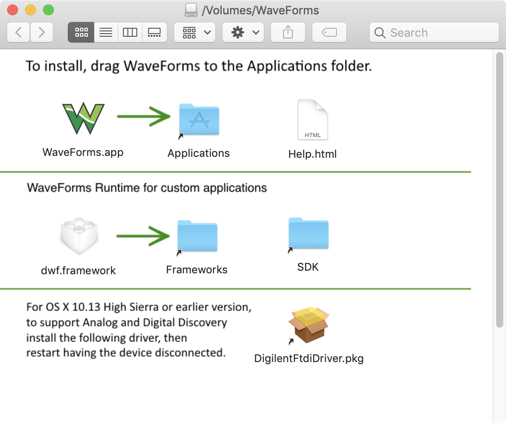

## What to Install on a Fresh System

1. [Sourcetree](https://www.sourcetreeapp.com/)
1. Pull Waveforms4j
1. Java 11 SDK - `brew cask install java`
1. [Mingw-w64](https://sourceforge.net/projects/mingw-w64/)
1. [Waveforms](https://reference.digilentinc.com/reference/software/waveforms/waveforms-3/start)
1. [IntelliJ](https://www.jetbrains.com/idea/download/index.html#section=windows)

## Install DWF Framework on MacOS

Download Waveforms from [Digilent](https://reference.digilentinc.com/reference/software/waveforms/waveforms-3/start) and open the DMG file, carrying on as usual. Move the `dwf.framework` to `/Library/Frameworks`, as indicated during the install of Waveforms from the DMG:




## Building the JNI Library

The following steps outline how to create the JNI library file and put it in the `resources` folder, which will get bundled with the deployable jar we build later with Maven. The final step is platform dependent, but the first steps are the same.


You need to find where the Java JNI Headers are located first and use it for the first two `-I` arguments:

```
sudo find / -name "jni.h"
find / -name jni_md.h 2> /dev/null

cd .../.../waveforms4j
gcc -lstdc++ -shared ./c/org_knowm_waveforms4j_DWF.cpp -I/Library/Java/JavaVirtualMachines/openjdk-11.0.2.jdk/Contents/Home/include -I/Library/Java/JavaVirtualMachines/openjdk-11.0.2.jdk/Contents/Home/include/darwin -F/Library/Frameworks -framework dwf -o waveforms4j.dylib
mv ./waveforms4j.dylib ./src/main/resources
```
 