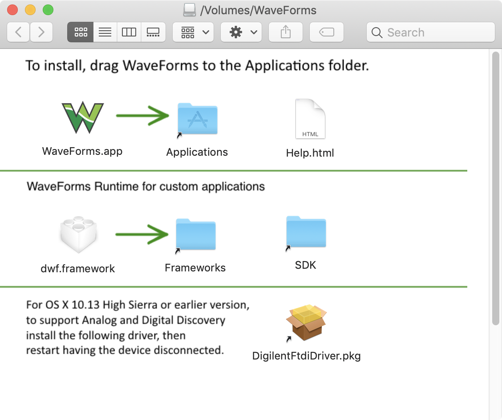

# Introduction

This library is a Java implementation of the Digilent Waveforms AD2 SDK. A C++ and Python SDK is provided by Digilent, but no Java SDK existed. The entire API is not yet implemented and this project is a work in progress. Most development has been done on a Mac, and at this time hasn't been tested on Linux or Windows. Porting to all systems should be trivial though.  

This library should work for your Java-based Waveforms app by simply adding the jar to your app's classpath. However, if you need to add more API features that are not yet implemented or need to make it work for Windows or Linux, then the rest of this readme file explains how to do that.

# Pre-requisites for Development

## Install DWF Framework on Mac OSX

Move the `dwf.framework` to `/Library/Frameworks`, as indicated during the install of Waveforms from the DMG:



## Install Java 8 Runtime Environment

### Option #1: Download and Install From Oracle

Download the Java SE Runtime Environment 8 from [Oracle's Website](http://www.oracle.com/technetwork/java/javase/downloads/jre8-downloads-2133155.html) and run the installer.

### Option #2: Install via Homebrew on Mac OSX
 
    brew update
    brew cask install java

## Prepare C++ for Development on Mac

    xcode-select --install
    brew update
    brew install homebrew/versions/gcc6

# Developing on Mac OSX

The SDK for the Digilent Analog Discovery 2 comes in the form of a compiled C++ framework. On Mac OSX, this comes in the form of a `*.framework` file, which is described above. On a Windows system, the SDK is a `.DLL`. In order to interact with the SDK with our Java app, we use Java JNI.

In single class called `DWF` is where our Java app code interacts with the SDK. DWF stands for `Digilent Waveform`. Note that in our `DWF` class, a static block is used to load the JNI library. We need to create this library manually and it's not provided By Digilent.

    static {
      try {
        NativeUtils.loadLibraryFromJar("/libdwf.jnilib");
      } catch (IOException e) {
        e.printStackTrace(); // This is probably not the best way to handle exception :-)
      }
    }
    
The `libdwf.jnilib` file is something we need to create ourselves. This file is the JNI bridge between our Java code and their binary SDK. Note that on Linux and Windows, we need to build additional binaries to load.

The following steps outline how to create the `libdwf.jnilib` file and put it in the `resources` folder, which will get bundled with the deployable jar we build.

## Move to project directory
    
    cd ~/path/to/waveforms4j

## Manually Compile All Java Classes (skip this if using Eclipse because Eclipse builds automatically on save)

    javac src/main/java/org/knowm/waveforms4j/*.java

## DWF Native Library

### Take the `native` methods we've defined in `DWF.java` and create a header file.

    javah -jni -classpath src/main/java -d ./c org.knowm.waveforms4j.DWF
    
Note: you need to take those methods created in the header file and implement them in the C++ file

### Compile the C++ and header files into a native library and move to `resources` folder.

You need to find where the Java JNI Headers are located first and use it for the first two `-I` arguments:

    sudo find / -name "jni.h"
    find / -name jni_md.h 2> /dev/null

    gcc-6 -lstdc++ -shared ./c/org_knowm_waveforms4j_DWF.cpp -I/Library/Java/JavaVirtualMachines/jdk1.8.0_112.jdk/Contents/Home/include -I/Library/Java/JavaVirtualMachines/jdk1.8.0_112.jdk/Contents/Home/include/darwin -F/Library/Frameworks/dwf.framework -framework dwf -o libdwf.jnilib
    mv ./libdwf.jnilib ./src/main/resources
    
I think for Windows and Linux, we need to create a `.dll` and `.so` file respectively using a similar `gcc` command as above.
    
## Some Resources

1. [Adept SDK Docs](https://reference.digilentinc.com/reference/software/adept/start?redirect=1id=digilent_adept_2#software_downloads)
1. [Waveforms 2015 Downloads](https://reference.digilentinc.com//reference/software/waveforms/waveforms-3/start?redirect=1id=waveforms3)
1. [Analog Discovery 2 Reference Manual](https://reference.digilentinc.com/analog_discovery_2/refmanual)
1. [Digilent's DWF library wrapper for python](https://github.com/amuramatsu/dwf)
1. [Waveforms3 Manual](https://reference.digilentinc.com/waveforms3/refmanual)

## Building

#### general

    mvn clean package  
    mvn javadoc:javadoc  
    
Since we moved the jni lib into `src/main/resources` in the above step, the native lib is bundled in the jar.

#### maven-license-plugin

    mvn license:check
    mvn license:format
    mvn license:remove
    
### Getting the Jar

The Yank release artifacts are hosted on [Maven Central](https://search.maven.org/#search%7Cga%7C1%7Cg%3A%22org.knowm.waveforms4j%22).

Or if you use Maven, add the following to your pom file:

```xml
<dependency>
    <groupId>org.knowm</groupId>
    <artifactId>waveforms4j</artifactId>
    <version>0.0.1</version>
</dependency>
```
For snapshots, add the following to your pom.xml file:
```xml
<repository>
  <id>sonatype-oss-snapshot</id>
  <snapshots/>
  <url>https://oss.sonatype.org/content/repositories/snapshots</url>
</repository>

<dependency>
    <groupId>org.knowm</groupId>
    <artifactId>waveforms4j</artifactId>
    <version>0.0.2-SNAPHOT</version>
</dependency>
```